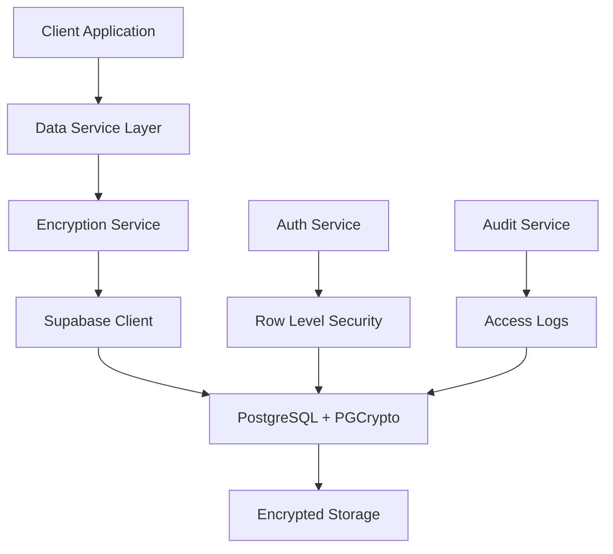

# Server-Side Encryption Integration Guide

**Production-Ready Implementation Guide for Supabase + PGCrypto**

_Comprehensive server-side encryption with automatic fallback strategies_

---

## 📋 Overview

This guide demonstrates how to implement server-side encryption using **Supabase + PGCrypto** for production applications. The implementation provides:

- **Server-side encryption** using PostgreSQL's PGCrypto extension
- **Automatic fallback strategies** for development and production environments
- **Production-grade security** with proper key management
- **Seamless integration** with React/TypeScript applications
- **Data protection** with audit capabilities

## 🏗️ Architecture Overview



### Key Components:

1. **EncryptionService** - Client-side coordinator for server-side encryption
2. **DataService** - Data management with encryption integration
3. **Database Functions** - Server-side encryption/decryption with PGCrypto
4. **Audit System** - Access logging for security
5. **Fallback System** - Development and emergency fallback mechanisms

---

## 🚀 Step-by-Step Integration

### Step 1: Database Setup (PostgreSQL + Supabase)

#### 1.1 Enable Required Extensions

```sql
-- Enable necessary extensions for encryption
CREATE EXTENSION IF NOT EXISTS "uuid-ossp";
CREATE EXTENSION IF NOT EXISTS "pgcrypto";
```

#### 1.2 Create Encryption Functions

```sql
-- Function to encrypt data server-side
CREATE OR REPLACE FUNCTION encrypt_data(data TEXT, user_key TEXT DEFAULT NULL)
RETURNS TEXT AS $$
DECLARE
    encryption_key TEXT;
BEGIN
    -- Use user-specific key or default to a server-side key
    encryption_key := COALESCE(user_key, current_setting('app.encryption_key', true));

    -- If no encryption key available, use a derived key from user ID
    IF encryption_key IS NULL THEN
        encryption_key := 'app_' || auth.uid()::text;
    END IF;

    RETURN pgp_sym_encrypt(data, encryption_key);
END;
$$ LANGUAGE plpgsql SECURITY DEFINER;

-- Function to decrypt data server-side
CREATE OR REPLACE FUNCTION decrypt_data(encrypted_data TEXT, user_key TEXT DEFAULT NULL)
RETURNS TEXT AS $$
DECLARE
    encryption_key TEXT;
BEGIN
    -- Use user-specific key or default to a server-side key
    encryption_key := COALESCE(user_key, current_setting('app.encryption_key', true));

    -- If no encryption key available, use a derived key from user ID
    IF encryption_key IS NULL THEN
        encryption_key := 'app_' || auth.uid()::text;
    END IF;

    RETURN pgp_sym_decrypt(encrypted_data, encryption_key);
EXCEPTION
    WHEN OTHERS THEN
        -- If decryption fails, return null rather than error
        RETURN NULL;
END;
$$ LANGUAGE plpgsql SECURITY DEFINER;
```

#### 1.3 Create Application Data Tables

```sql
-- User data table with encrypted fields
CREATE TABLE IF NOT EXISTS user_data (
    id UUID PRIMARY KEY DEFAULT gen_random_uuid(),
    user_id UUID REFERENCES auth.users(id) ON DELETE CASCADE UNIQUE NOT NULL,

    -- Encrypted user data using server-side encryption
    encrypted_content TEXT, -- Encrypted with pgp_sym_encrypt
    encrypted_preferences JSONB, -- Application preferences

    -- Non-sensitive metadata
    data_version INTEGER DEFAULT 1,
    created_at TIMESTAMP WITH TIME ZONE DEFAULT NOW(),
    updated_at TIMESTAMP WITH TIME ZONE DEFAULT NOW()
);

-- Application records with encrypted sensitive fields
CREATE TABLE IF NOT EXISTS user_records (
    id UUID PRIMARY KEY DEFAULT gen_random_uuid(),
    user_id UUID REFERENCES auth.users(id) ON DELETE CASCADE NOT NULL,
    record_id TEXT NOT NULL,

    -- Encrypted record data using server-side functions
    encrypted_record_data JSONB NOT NULL, -- Encrypted JSON data

    -- Metadata for sync and management
    is_deleted BOOLEAN DEFAULT FALSE,
    deleted_at TIMESTAMP WITH TIME ZONE,
    version INTEGER DEFAULT 1,
    last_modified TIMESTAMP WITH TIME ZONE DEFAULT NOW(),
    created_at TIMESTAMP WITH TIME ZONE DEFAULT NOW()
);
```

#### 1.4 Setup Row Level Security (RLS)

```sql
-- Enable RLS on all sensitive tables
ALTER TABLE user_data ENABLE ROW LEVEL SECURITY;
ALTER TABLE user_records ENABLE ROW LEVEL SECURITY;

-- Create policies to ensure users only access their own data
CREATE POLICY "Users can only access own data" ON user_data
    FOR ALL USING (auth.uid() = user_id);

CREATE POLICY "Users can only access own records" ON user_records
    FOR ALL USING (auth.uid() = user_id);
```

### Step 2: Client-Side Encryption Service

#### 2.1 Create EncryptionService Class

```typescript
// src/services/encryptionService.ts
import { supabase } from '../utils/supabase';
import type { Session } from '@supabase/supabase-js';

/**
 * Production-ready encryption service using Supabase + PGCrypto
 * Coordinates with server-side encryption functions for maximum security
 */
export class EncryptionService {
  private static instance: EncryptionService;
  private initialized: boolean = false;
  private currentSession: Session | null = null;

  private constructor() {
    this.initialize();
  }

  /**
   * Initialize encryption service with authentication context
   */
  private async initialize(): Promise<void> {
    try {
      // Set up auth state listener
      supabase.auth.onAuthStateChange((event, session) => {
        this.currentSession = session;
        if (import.meta.env.DEV) {
          console.log(
            '🔐 Auth state changed:',
            event,
            session ? 'authenticated' : 'unauthenticated'
          );
        }
      });

      // Get initial session
      const {
        data: { session },
      } = await supabase.auth.getSession();
      this.currentSession = session;

      this.initialized = true;
    } catch (error) {
      console.warn('⚠️ Encryption service initialization warning:', error);
      this.initialized = true; // Continue with fallback mode
    }
  }

  public static getInstance(): EncryptionService {
    if (!EncryptionService.instance) {
      EncryptionService.instance = new EncryptionService();
    }
    return EncryptionService.instance;
  }

  /**
   * Check if user is authenticated for server-side encryption
   */
  private isAuthenticated(): boolean {
    return this.currentSession?.user?.id != null;
  }

  /**
   * Generate user-specific encryption key for server-side functions
   */
  private generateUserEncryptionKey(userId: string): string {
    return `app_key_${userId}_${process.env.NODE_ENV || 'development'}`;
  }

  /**
   * Encrypt data using server-side PGCrypto functions
   */
  public async encrypt(data: any, userId: string): Promise<string> {
    if (data === null || data === undefined) {
      throw new Error('Cannot encrypt null or undefined data');
    }

    const jsonData = JSON.stringify(data);

    // Check authentication before attempting server-side encryption
    if (!this.isAuthenticated()) {
      if (import.meta.env.DEV) {
        console.log('🔄 User not authenticated, using development fallback');
      }
      return `fallback:${Buffer.from(jsonData).toString('base64')}`;
    }

    try {
      // Use server-side encryption function
      const { data: encryptedData, error } = await supabase.rpc('encrypt_data', {
        data: jsonData,
        user_key: this.generateUserEncryptionKey(userId),
      });

      if (error) {
        if (import.meta.env.DEV) {
          console.log('🔄 Server-side encryption failed:', error.message);
        }
        // Fallback for development
        return `fallback:${Buffer.from(jsonData).toString('base64')}`;
      }

      if (import.meta.env.DEV) {
        console.log('✅ Server-side encryption successful');
      }
      return encryptedData;
    } catch (error) {
      if (import.meta.env.DEV) {
        console.log('🔄 Encryption service unavailable, using fallback:', error);
      }
      return `fallback:${Buffer.from(jsonData).toString('base64')}`;
    }
  }

  /**
   * Decrypt data with format detection and fallback handling
   */
  public async decrypt<T = any>(data: string, userId: string): Promise<T> {
    if (!data || typeof data !== 'string') {
      return this.createSafeFallback<T>();
    }

    const format = this.detectDataFormat(data);

    try {
      // Handle fallback-encoded data (development)
      if (format === 'fallback') {
        const encodedData = data.substring(9); // Remove 'fallback:' prefix
        const decodedData = Buffer.from(encodedData, 'base64').toString('utf-8');
        return JSON.parse(decodedData);
      }

      // Handle binary PGCrypto data (production)
      if (format === 'binary' && this.isAuthenticated()) {
        const { data: decryptedData, error } = await supabase.rpc('decrypt_data', {
          encrypted_data: data,
          user_key: this.generateUserEncryptionKey(userId),
        });

        if (!error && decryptedData) {
          return JSON.parse(decryptedData);
        }
      }

      // Handle JSON data (already decrypted)
      if (format === 'json') {
        return JSON.parse(data);
      }

      // Return safe fallback for unknown formats
      return this.createSafeFallback<T>();
    } catch (error) {
      if (import.meta.env.DEV) {
        console.log('🔄 Decryption error, using safe fallback:', error);
      }
      return this.createSafeFallback<T>();
    }
  }

  /**
   * Detect the format of encrypted data
   */
  private detectDataFormat(data: string): 'binary' | 'base64' | 'json' | 'fallback' | 'unknown' {
    if (!data || typeof data !== 'string') return 'unknown';

    if (data.startsWith('fallback:')) return 'fallback';
    if (data.startsWith('\\x') && /^\\x[0-9a-fA-F]+$/.test(data)) return 'binary';
    if (/^[A-Za-z0-9+/]+=*$/.test(data) && data.length % 4 === 0) return 'base64';

    try {
      JSON.parse(data);
      return 'json';
    } catch {
      return 'unknown';
    }
  }

  /**
   * Create safe fallback data when decryption fails
   */
  private createSafeFallback<T>(expectedType: string = 'object'): T {
    const fallbacks: Record<string, any> = {
      array: [],
      object: {},
      string: '',
      number: 0,
      boolean: false,
    };

    return fallbacks[expectedType] || fallbacks['object'];
  }

  /**
   * Test encryption functionality
   */
  public async testEncryption(userId: string): Promise<boolean> {
    try {
      const testData = { test: 'Encryption test', timestamp: Date.now() };
      const encrypted = await this.encrypt(testData, userId);
      const decrypted = await this.decrypt(encrypted, userId);

      const isValid = JSON.stringify(testData) === JSON.stringify(decrypted);

      return isValid;
    } catch (error) {
      console.error('❌ Encryption test failed:', error);
      return false;
    }
  }

  /**
   * Get service health status for monitoring
   */
  public getHealthStatus(): {
    status: 'healthy' | 'degraded' | 'unhealthy';
    details: Record<string, any>;
  } {
    return {
      status: this.initialized ? 'healthy' : 'degraded',
      details: {
        initialized: this.initialized,
        encryption_method: 'pgcrypto_server_side',
        authenticated: this.isAuthenticated(),
        last_check: new Date().toISOString(),
      },
    };
  }
}

// Export singleton instance
export const encryptionService = EncryptionService.getInstance();
```

### Step 3: Data Service Integration

#### 3.1 Create Data Service with Encryption

```typescript
// src/services/dataService.ts
import { supabase } from '../utils/supabase';
import { encryptionService } from './encryptionService';

export class DataService {
  /**
   * Log data access for audit purposes
   */
  private async logDataAccess(
    action: string,
    tableName: string,
    userId: string,
    metadata: Record<string, any> = {}
  ): Promise<void> {
    try {
      await supabase.from('audit_logs').insert({
        user_id: userId,
        action,
        table_name: tableName,
        metadata: {
          ...metadata,
          timestamp: new Date().toISOString(),
        },
      });
    } catch (error) {
      console.warn('⚠️ Audit logging failed:', error);
    }
  }

  /**
   * Safely decrypt data that might be encrypted string or plain JSONB
   */
  private async safeDecrypt(encryptedData: any, userId: string): Promise<any> {
    if (encryptedData === null || encryptedData === undefined) {
      return null;
    }

    // If data is already an object (JSONB), return directly
    if (typeof encryptedData === 'object') {
      console.log('🔄 Found JSONB data (pre-encryption), using directly');
      return encryptedData;
    }

    // If data is a string, attempt decryption
    if (typeof encryptedData === 'string') {
      try {
        return await encryptionService.decrypt(encryptedData, userId);
      } catch (error) {
        console.warn('⚠️ Decryption failed, trying JSON parse fallback:', error);
        try {
          return JSON.parse(encryptedData);
        } catch {
          return null;
        }
      }
    }

    return encryptedData;
  }

  /**
   * Store encrypted data
   */
  async storeData<T>(key: string, data: T, userId: string): Promise<void> {
    try {
      // Encrypt the data before storage
      const encryptedData = await encryptionService.encrypt(data, userId);

      // Store in user_data table
      const { error } = await supabase.from('user_data').upsert({
        user_id: userId,
        encrypted_content: encryptedData,
        data_version: 1,
      });

      if (error) throw error;

      // Log for audit
      await this.logDataAccess('DATA_STORE', 'user_data', userId, {
        operation: 'store',
        data_type: key,
        encryption_used: true,
      });
    } catch (error) {
      console.error(`❌ Failed to store ${key}:`, error);
      throw error;
    }
  }

  /**
   * Retrieve and decrypt data
   */
  async retrieveData<T>(key: string, userId: string): Promise<T | null> {
    try {
      // Retrieve from user_data table
      const { data, error } = await supabase
        .from('user_data')
        .select('encrypted_content')
        .eq('user_id', userId)
        .single();

      if (error) {
        if (error.code === 'PGRST116') {
          // No rows found
          return null;
        }
        throw error;
      }

      // Decrypt the data
      const decryptedData = await this.safeDecrypt(data.encrypted_content, userId);

      // Log access for audit
      await this.logDataAccess('DATA_ACCESS', 'user_data', userId, {
        operation: 'retrieve',
        data_type: key,
        encryption_used: true,
      });

      return decryptedData;
    } catch (error) {
      console.error(`❌ Failed to retrieve ${key}:`, error);
      return null;
    }
  }

  /**
   * Store multiple records with encryption
   */
  async storeRecords<T>(records: T[], userId: string): Promise<void> {
    try {
      const recordInserts = await Promise.all(
        records.map(async (record: any, index) => {
          const encryptedData = await encryptionService.encrypt(record, userId);
          return {
            user_id: userId,
            record_id: record.id || `record_${index}_${Date.now()}`,
            encrypted_record_data: record,
            version: 1,
          };
        })
      );

      if (recordInserts.length > 0) {
        const { error } = await supabase.from('user_records').insert(recordInserts);

        if (error) throw error;
      }

      await this.logDataAccess('DATA_STORE', 'user_records', userId, {
        operation: 'store_batch',
        record_count: records.length,
        encryption_used: true,
      });
    } catch (error) {
      console.error('❌ Failed to store records:', error);
      throw error;
    }
  }

  /**
   * Retrieve and decrypt multiple records
   */
  async retrieveRecords<T>(userId: string): Promise<T[]> {
    try {
      const { data, error } = await supabase
        .from('user_records')
        .select('encrypted_record_data, record_id, created_at')
        .eq('user_id', userId)
        .eq('is_deleted', false)
        .order('created_at', { ascending: false });

      if (error) throw error;
      if (!data || data.length === 0) return [];

      // Decrypt each record
      const decryptedRecords = await Promise.all(
        data.map(async (row: any) => {
          try {
            const decrypted = await this.safeDecrypt(row.encrypted_record_data, userId);
            return {
              ...decrypted,
              id: row.record_id,
            };
          } catch (error) {
            console.warn('⚠️ Failed to decrypt record:', error);
            return null;
          }
        })
      );

      await this.logDataAccess('DATA_ACCESS', 'user_records', userId, {
        operation: 'retrieve_batch',
        record_count: data.length,
        encryption_used: true,
      });

      return decryptedRecords.filter(record => record !== null);
    } catch (error) {
      console.error('❌ Failed to retrieve records:', error);
      return [];
    }
  }

  /**
   * Delete data with proper cleanup
   */
  async deleteData(userId: string): Promise<void> {
    try {
      // Soft delete user records
      await supabase
        .from('user_records')
        .update({
          is_deleted: true,
          deleted_at: new Date().toISOString(),
        })
        .eq('user_id', userId);

      // Clear user data
      await supabase.from('user_data').delete().eq('user_id', userId);

      await this.logDataAccess('DATA_DELETE', 'user_data', userId, {
        operation: 'delete_all',
        timestamp: new Date().toISOString(),
      });
    } catch (error) {
      console.error('❌ Failed to delete data:', error);
      throw error;
    }
  }
}

// Export the data service
export const dataService = new DataService();
```

### Step 4: Production Configuration

#### 4.1 Environment Variables

```env
# Supabase Configuration
VITE_SUPABASE_URL=your_supabase_url
VITE_SUPABASE_ANON_KEY=your_supabase_anon_key

# Production Encryption (Server-side only)
SUPABASE_SERVICE_ROLE_KEY=your_service_role_key
APP_ENCRYPTION_KEY=your_production_encryption_key
```

#### 4.2 Supabase Configuration

```sql
-- Set application-level encryption key (production only)
-- This should be set via Supabase dashboard or CLI
ALTER DATABASE postgres SET app.encryption_key = 'your-production-encryption-key-here';
```

### Step 5: Testing and Validation

#### 5.1 Create Encryption Test

```typescript
// tests/encryption.test.ts
import { encryptionService } from '../src/services/encryptionService';
import { dataService } from '../src/services/dataService';

describe('Server-Side Encryption', () => {
  const testUserId = 'test-user-123';
  const testData = {
    message: 'Hello, World!',
    number: 42,
    array: [1, 2, 3],
    nested: { key: 'value' },
  };

  test('should encrypt and decrypt data correctly', async () => {
    const encrypted = await encryptionService.encrypt(testData, testUserId);
    expect(typeof encrypted).toBe('string');
    expect(encrypted).not.toBe(JSON.stringify(testData));

    const decrypted = await encryptionService.decrypt(encrypted, testUserId);
    expect(decrypted).toEqual(testData);
  });

  test('should handle fallback data format', async () => {
    const fallbackData = 'fallback:' + Buffer.from(JSON.stringify(testData)).toString('base64');
    const decrypted = await encryptionService.decrypt(fallbackData, testUserId);
    expect(decrypted).toEqual(testData);
  });

  test('should store and retrieve data through DataService', async () => {
    await dataService.storeData('test-key', testData, testUserId);
    const retrieved = await dataService.retrieveData('test-key', testUserId);
    expect(retrieved).toEqual(testData);
  });

  test('should run health check', () => {
    const health = encryptionService.getHealthStatus();
    expect(health.status).toBe('healthy');
    expect(health.details.encryption_method).toBe('pgcrypto_server_side');
  });
});
```

---

## 🔧 Configuration & Deployment

### Production Checklist

- [ ] Enable PGCrypto extension in Supabase
- [ ] Deploy database functions for encryption/decryption
- [ ] Configure Row Level Security policies
- [ ] Set production encryption keys via Supabase dashboard
- [ ] Test encryption/decryption flow end-to-end
- [ ] Setup monitoring for encryption failures
- [ ] Configure proper environment variables
- [ ] Verify fallback mechanisms work in development

### Security Considerations

1. **Encryption Keys**: Never store keys in client-side code
2. **Key Management**: Use Supabase environment variables for server-side keys
3. **Access Control**: Implement proper Row Level Security
4. **Audit Trails**: Log all data access for security monitoring
5. **Fallback Strategy**: Ensure development fallback never reaches production

### Performance Optimization

1. **Connection Pooling**: Use Supabase's built-in connection pooling
2. **Caching**: Implement appropriate caching strategies for decrypted data
3. **Batch Operations**: Use batch operations for multiple records
4. **Indexing**: Create proper database indexes for encrypted data queries

---

## 🎯 Best Practices

### Development

- Use fallback encryption for local development
- Test both encrypted and fallback data paths
- Implement proper error handling for encryption failures
- Use TypeScript for type safety

### Production

- Always use server-side encryption in production
- Monitor encryption success/failure rates
- Implement proper key rotation procedures
- Regular security audits

### Monitoring

- Track encryption operation performance
- Monitor authentication failures
- Alert on fallback mode activation in production
- Log all data access for security analysis

---

## 🔍 Troubleshooting

### Common Issues

#### 1. PGCrypto Extension Not Available

```sql
-- Check if extension is installed
SELECT * FROM pg_extension WHERE extname = 'pgcrypto';

-- Enable extension (Supabase dashboard required)
CREATE EXTENSION IF NOT EXISTS "pgcrypto";
```

#### 2. Encryption Function Not Found

```sql
-- Verify function exists
SELECT proname FROM pg_proc WHERE proname LIKE '%encrypt_data%';
```

#### 3. Always in Fallback Mode

- Check user authentication status
- Verify Supabase connection
- Ensure encryption functions are deployed
- Check console for authentication errors

#### 4. Decryption Failures

- Verify encryption key consistency
- Check data format detection logic
- Ensure proper error handling
- Review audit logs for patterns

### Debug Commands

```typescript
// Test encryption service
await encryptionService.testEncryption(userId);

// Check service health
const health = encryptionService.getHealthStatus();

// Enable debug mode
if (import.meta.env.DEV) {
  // Additional logging automatically enabled
}
```

---

## 📚 Additional Resources

### Documentation

- [Supabase PGCrypto Guide](https://supabase.com/docs/guides/database/extensions/pgcrypto)
- [PostgreSQL Encryption Documentation](https://www.postgresql.org/docs/current/pgcrypto.html)
- [Supabase Row Level Security](https://supabase.com/docs/guides/database/postgres/row-level-security)

### Security Standards

- **AES-256** encryption for data at rest
- **TLS 1.3** for data in transit
- **Row Level Security** for access control
- **Audit logging** for compliance

This implementation provides production-ready server-side encryption with proper fallback mechanisms, making it suitable for any application requiring secure data storage.
